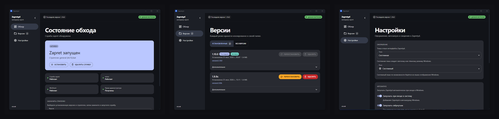
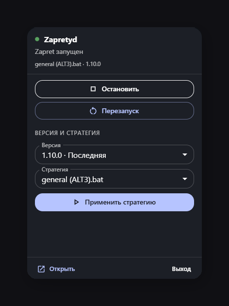
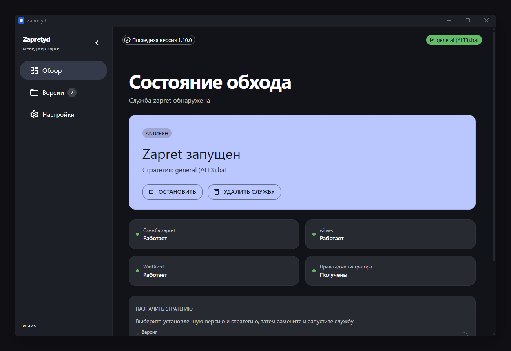
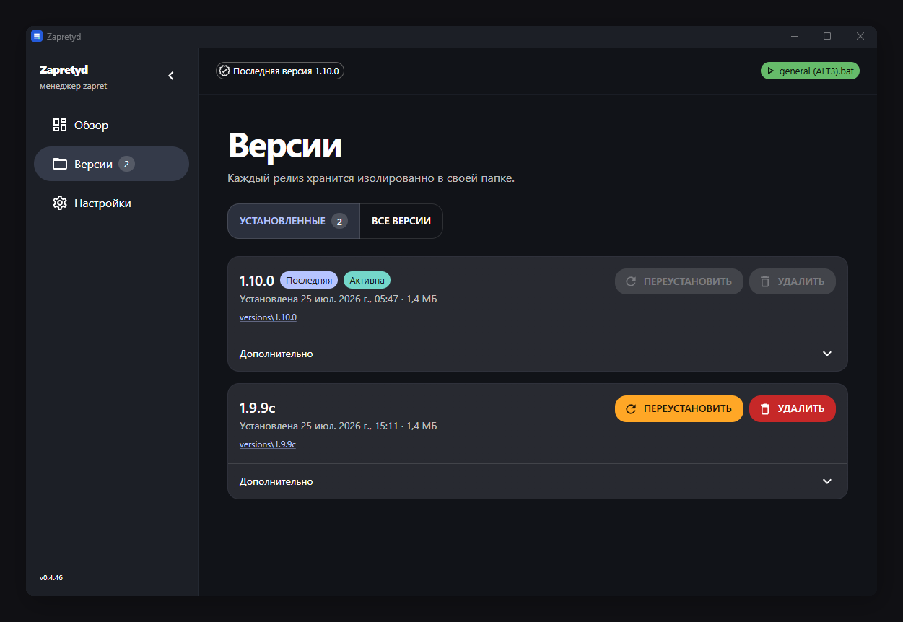
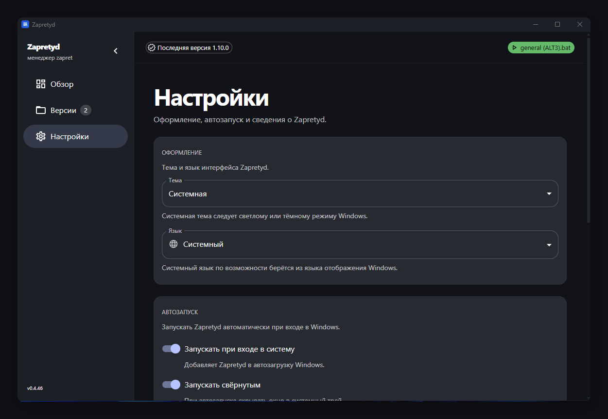

# Zapretyd

A Windows desktop manager for [Flowseal/zapret-discord-youtube](https://github.com/Flowseal/zapret-discord-youtube) releases.

Zapretyd downloads official GitHub releases, keeps each version in an isolated folder, and helps you activate a strategy as the Windows `zapret` service — without manually editing batch files or service entries.

## Features

- **Release management** — check for updates, download, and install the latest zapret ZIP from GitHub
- **Version library** — store multiple releases side by side in the app library folder
- **Overview** — see service, WinDivert, and `winws.exe` status, then pick a strategy and create, start, stop, or remove the `zapret` Windows service
- **Safe paths** — the library uses an ASCII-safe folder under the app data directory (or `C:\Zapretyd` as a fallback)
- **System tray** — quick stop / restart and strategy switch from the tray popup

## Screenshots

  

  

Individual screens

| | |
| :---: | :---: |
| **Overview** | **Versions** |
|  |  |
| **Settings** | **System tray** |
|  |  |

## Download

Installers are published on the [GitHub Releases](https://github.com/NemoKing1210/Zapretyd/releases) page (NSIS `.exe` for Windows 10/11).

Administrator rights are required to create, start, stop, or remove the Windows service.

## How it works

1. Releases are extracted to `<library>\versions\<tag>\`
2. Each version ships with `.bat` strategy files; Zapretyd lists them per version
3. Activating a strategy registers and starts the `zapret` Windows service
4. The app can check GitHub for newer `zapret-discord-youtube` releases

## Notes

- Zapretyd does not bundle zapret — it only downloads from the upstream GitHub project.
- If the service fails to start, verify WinDivert is installed and the selected strategy is valid.
- Restart Zapretyd as administrator before managing the Windows service.
- UI language follows the Windows system locale (English or Russian). English is used as fallback.

## Development

Build from source, scripts, versioning, and GitHub Releases: see **[DEVELOPMENT.md](./DEVELOPMENT.md)**.

## License

Zapretyd is licensed under the [MIT License](./LICENSE).

Downloaded [zapret-discord-youtube](https://github.com/Flowseal/zapret-discord-youtube) releases remain under their upstream license terms; Zapretyd does not relicense that software.
